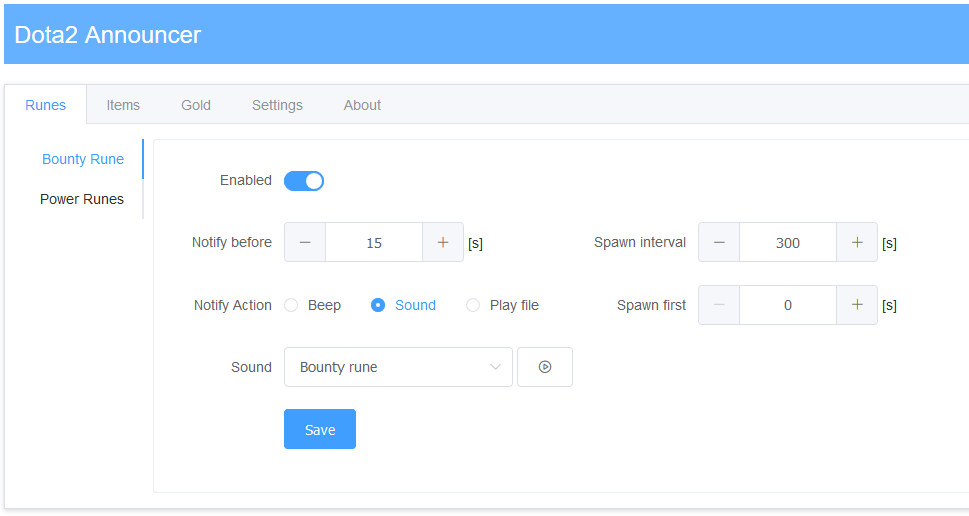
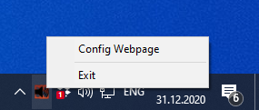
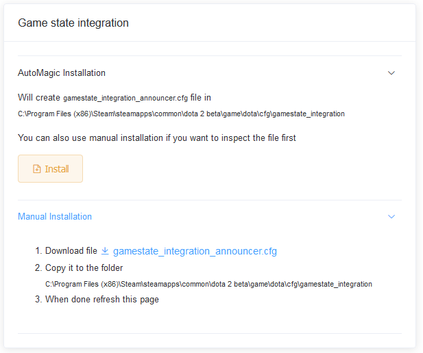

# Dota2 Announcer

Announcer for Dota2 to remind you about various game events such as:

- Bounty rune
- Power rune 
- Tomb of knowledge restock
- Observer ward restock
- Neutral Items availability in neutral camps
- Buyback ready (timer + gold)

_(can be enable individually)_

You can specify if you want to use build in sounds or simple beeps to be played.
Or you can provide your own mp3 file

Announcer is written in [Rust language](https://www.rust-lang.org/) using [Rocket.rs](https://rocket.rs/) as fast server for handling Dota2 game state events. [Vue.js](https://vuejs.org/) is used on the frontend (I'm not the best UI guy :trollface:)

## Screenshot

## Usage
Once you run the executable it will create new tray icon  (next to the clock).

You can right click on it to show menu and open `Config Webpage` or you can manually enter the following URL in your favorite browser
`http://127.0.0.1:8000`

## Dota2 Integration
You can use AutoMagic:tm: one click installation button in `Settings` tab or follow manual steps

